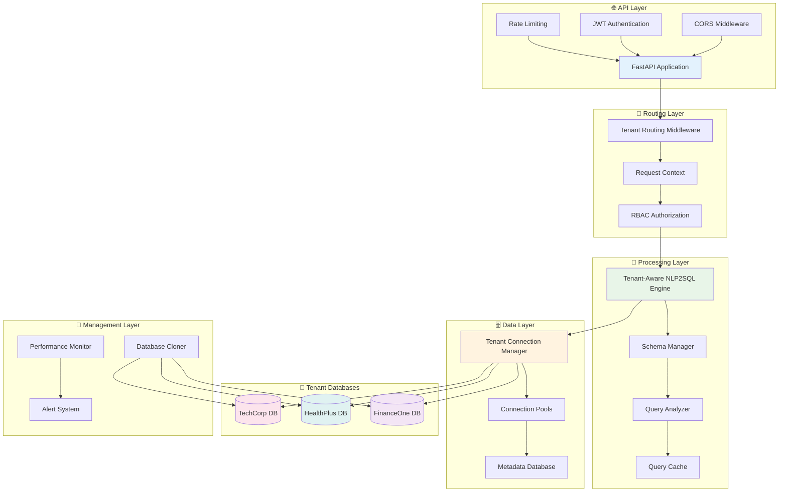
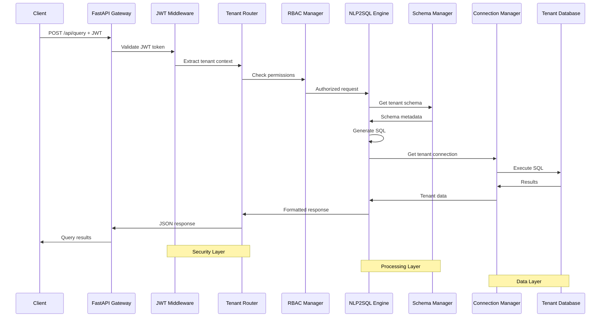

# 🚀 Multi-Tenant NLP2SQL Backend Architecture Explained

## 📋 Table of Contents
1. [Backend Overview](#backend-overview)
2. [Request Flow Through Backend](#request-flow-through-backend)
3. [Core Backend Components](#core-backend-components)
4. [Database Layer Architecture](#database-layer-architecture)
5. [Security & Authentication Layer](#security--authentication-layer)
6. [NLP2SQL Processing Engine](#nlp2sql-processing-engine)
7. [Multi-Tenant Management](#multi-tenant-management)
8. [API Endpoints & Routing](#api-endpoints--routing)
9. [Performance & Monitoring](#performance--monitoring)
10. [Error Handling & Resilience](#error-handling--resilience)

---

## 🏗️ Backend Overview

The Multi-Tenant NLP2SQL backend is built on **FastAPI** with a sophisticated multi-layered architecture that ensures complete tenant isolation while providing high-performance natural language to SQL conversion.

### **Architecture Stack:**



---

## 🔄 Request Flow Through Backend

### **Complete Request Lifecycle:**



### **Step-by-Step Request Processing:**

**1. Request Reception (`src/main.py`):**
```python
@app.post("/api/query")
async def process_query(
    request: QueryRequest,
    context: TenantRoutingContext = Depends(get_tenant_context)
):
    # Request arrives at FastAPI gateway
    # CORS middleware handles cross-origin requests
    # Rate limiting checks request frequency
```

**2. JWT Authentication (`src/jwt_middleware.py`):**
```python
class JWTMiddleware:
    async def __call__(self, request: Request, call_next):
        # Extract JWT token from Authorization header
        token = request.headers.get("Authorization", "").replace("Bearer ", "")

        # Decode and validate JWT
        try:
            payload = jwt.decode(token, JWT_SECRET, algorithms=["HS256"])
            tenant_id = payload["tenant_id"]
            user_id = payload["user_id"]
            roles = payload["roles"]
        except jwt.InvalidTokenError:
            raise HTTPException(status_code=401, detail="Invalid token")
```

**3. Tenant Context Extraction (`src/tenant_routing_middleware.py`):**
```python
class TenantRoutingMiddleware:
    async def dispatch(self, request: Request, call_next):
        # Create tenant context from JWT payload
        context = TenantRoutingContext(
            user_id=payload["user_id"],
            tenant_id=payload["tenant_id"],
            roles=payload["roles"],
            connection_manager=self.connection_manager
        )

        # Attach context to request
        request.state.tenant_context = context
```

**4. RBAC Authorization (`src/tenant_rbac_manager.py`):**
```python
class TenantRBACManager:
    async def check_permission(self, context: TenantRoutingContext, action: str):
        # Verify user has permission for this action within their tenant
        permissions = await self.get_user_permissions(
            context.user_id,
            context.tenant_id
        )

        if action not in permissions:
            raise HTTPException(status_code=403, detail="Insufficient permissions")
```

**5. NLP2SQL Processing (`src/tenant_aware_nlp2sql.py`):**
```python
class TenantAwareNLP2SQL:
    async def process_query(self, query: str, context: TenantRoutingContext):
        # Get tenant-specific schema
        schema = await self.schema_manager.get_tenant_schema(context.tenant_id)

        # Analyze query with tenant context
        analysis = await self.analyze_query(query, schema)

        # Generate SQL with security checks
        sql = await self.generate_sql(query, schema, context.roles)

        # Execute on tenant database
        results = await self.execute_query(sql, context.tenant_id)

        return QueryResult(
            tenant_id=context.tenant_id,
            generated_sql=sql,
            results=results,
            security_filtered=True
        )
```

---

## 🧱 Core Backend Components

### **1. FastAPI Application Core (`src/main.py`)**

**Purpose:** Main application entry point and configuration

**Key Features:**
```python
# Application initialization
app = FastAPI(
    title="Multi-Tenant NLP2SQL API",
    description="AI service for natural language to SQL conversion",
    version="1.0.0",
    lifespan=lifespan  # Handles startup/shutdown
)

# Middleware stack
app.add_middleware(CORSMiddleware, ...)  # Cross-origin requests
setup_jwt_middleware(app, ...)          # JWT authentication
setup_tenant_routing_middleware(app, ...)  # Tenant routing

# Component initialization
rbac_manager = TenantRBACManager(config, JWT_SECRET)
connection_manager = TenantConnectionManager(database_cloner)
nlp2sql_engine = TenantAwareNLP2SQL(connection_manager)
```

**Health Check System:**
```python
@app.get("/health")
async def health_check():
    # Test all critical components
    services = {
        "metadata_db": test_metadata_connection(),
        "nlp2sql_engine": test_nlp_engine(),
        "rbac_system": test_rbac_connectivity(),
        "tenant_connections": test_tenant_pools()
    }

    if all(services.values()):
        return {"status": "healthy", "services": services}
    else:
        raise HTTPException(503, "Service unhealthy")
```

### **2. Authentication & Security (`src/auth.py`, `src/security.py`)**

**JWT Token Management:**
```python
class AuthManager:
    def create_token(self, user_id: str, tenant_id: str, roles: List[str]) -> str:
        payload = {
            "user_id": user_id,
            "tenant_id": tenant_id,
            "roles": roles,
            "iat": datetime.utcnow(),
            "exp": datetime.utcnow() + timedelta(hours=24)
        }
        return jwt.encode(payload, JWT_SECRET, algorithm="HS256")

    def validate_token(self, token: str) -> Dict[str, Any]:
        try:
            payload = jwt.decode(token, JWT_SECRET, algorithms=["HS256"])
            return {"valid": True, "payload": payload}
        except jwt.ExpiredSignatureError:
            return {"valid": False, "error": "Token expired"}
        except jwt.InvalidTokenError:
            return {"valid": False, "error": "Invalid token"}
```

**Security Manager:**
```python
class SecurityManager:
    def check_rate_limit(self, user_id: str, ip_address: str) -> Dict[str, Any]:
        # Check rate limiting by user and IP
        user_limit = self.rate_limiters.get(user_id, RateLimiter(100, 3600))  # 100/hour
        ip_limit = self.rate_limiters.get(ip_address, RateLimiter(200, 3600))  # 200/hour

        if user_limit.is_exceeded() or ip_limit.is_exceeded():
            return {"rate_limited": True, "retry_after": user_limit.retry_after}

        return {"rate_limited": False}

    def validate_sql_security(self, sql: str, context: TenantRoutingContext) -> bool:
        # Check for SQL injection patterns
        dangerous_patterns = [
            r"DROP\s+TABLE", r"DELETE\s+FROM", r"TRUNCATE",
            r"ALTER\s+TABLE", r"CREATE\s+USER", r"GRANT\s+ALL"
        ]

        for pattern in dangerous_patterns:
            if re.search(pattern, sql, re.IGNORECASE):
                logger.warning(f"Dangerous SQL detected from {context.user_id}: {sql}")
                return False

        return True
```

### **3. Tenant Connection Manager (`src/tenant_connection_manager.py`)**

**Connection Pool Management:**
```python
class TenantConnectionManager:
    def __init__(self, database_cloner: DatabaseCloner):
        self.database_cloner = database_cloner
        self._connection_pools: Dict[str, Any] = {}
        self._tenant_info: Dict[str, TenantConnectionInfo] = {}
        self._lock = threading.RLock()

    async def get_connection(self, tenant_id: str) -> Any:
        """Get connection from tenant-specific pool."""
        with self._lock:
            # Check if pool exists
            if tenant_id not in self._connection_pools:
                await self._create_tenant_pool(tenant_id)

            pool = self._connection_pools[tenant_id]

            try:
                # Acquire connection from tenant's pool only
                connection = await pool.acquire()

                # Update metrics
                self._record_connection_metrics(tenant_id, "acquired")

                return connection

            except Exception as e:
                self._record_connection_metrics(tenant_id, "failed")
                raise ConnectionError(f"Failed to get connection for {tenant_id}: {e}")

    async def _create_tenant_pool(self, tenant_id: str):
        """Create connection pool for tenant."""
        # Get tenant clone information
        clone = self.database_cloner.get_tenant_clone(tenant_id)
        if not clone:
            raise TenantNotFoundError(f"No clone found for tenant {tenant_id}")

        # Create pool configuration
        pool_config = {
            "host": "localhost",
            "port": clone.port,
            "database": f"tenant_{tenant_id}",
            "user": f"tenant_{tenant_id}_user",
            "password": clone.connection_params["password"],
            "minconn": 5,    # Minimum connections
            "maxconn": 20,   # Maximum connections
            "pool_timeout": 30
        }

        # Create isolated pool
        if clone.database_type == DatabaseType.POSTGRESQL:
            pool = await asyncpg.create_pool(**pool_config)
        elif clone.database_type == DatabaseType.MYSQL:
            pool = await aiomysql.create_pool(**pool_config)

        self._connection_pools[tenant_id] = pool

        # Store tenant info
        self._tenant_info[tenant_id] = TenantConnectionInfo(
            tenant_id=tenant_id,
            database_type=clone.database_type,
            connection_params=pool_config,
            pool_size=20,
            created_at=datetime.utcnow(),
            status=ConnectionStatus.HEALTHY
        )
```

---

## 🧠 NLP2SQL Processing Engine

### **Tenant-Aware Query Processing (`src/tenant_aware_nlp2sql.py`)**

**Schema Context Management:**
```python
class TenantSchemaManager:
    def __init__(self, connection_manager: TenantConnectionManager):
        self.connection_manager = connection_manager
        self.schema_cache: Dict[str, TenantSchemaInfo] = {}
        self.cache_ttl = 3600  # 1 hour cache

    async def get_tenant_schema(self, tenant_id: str) -> TenantSchemaInfo:
        """Get tenant-specific database schema."""
        # Check cache first
        if tenant_id in self.schema_cache:
            schema = self.schema_cache[tenant_id]
            if (datetime.utcnow() - schema.last_updated).seconds < self.cache_ttl:
                return schema

        # Extract schema from tenant database
        schema = await self._extract_schema_from_database(tenant_id)

        # Cache for future use
        self.schema_cache[tenant_id] = schema

        return schema

    async def _extract_schema_from_database(self, tenant_id: str) -> TenantSchemaInfo:
        """Extract schema information from tenant database."""
        async with self.connection_manager.get_connection_context(tenant_id) as conn:
            # Get table information
            tables = {}

            if tenant_info.database_type == DatabaseType.POSTGRESQL:
                # PostgreSQL schema extraction
                table_query = """
                SELECT table_name, column_name, data_type, is_nullable
                FROM information_schema.columns
                WHERE table_schema = 'public'
                ORDER BY table_name, ordinal_position
                """
            elif tenant_info.database_type == DatabaseType.MYSQL:
                # MySQL schema extraction
                table_query = """
                SELECT table_name, column_name, data_type, is_nullable
                FROM information_schema.columns
                WHERE table_schema = DATABASE()
                ORDER BY table_name, ordinal_position
                """

            result = await conn.fetch(table_query)

            # Process results into schema structure
            for row in result:
                table_name = row['table_name']
                if table_name not in tables:
                    tables[table_name] = {'columns': {}, 'relationships': []}

                tables[table_name]['columns'][row['column_name']] = {
                    'type': row['data_type'],
                    'nullable': row['is_nullable'] == 'YES'
                }

            return TenantSchemaInfo(
                tenant_id=tenant_id,
                database_type=tenant_info.database_type,
                tables=tables,
                last_updated=datetime.utcnow(),
                schema_version="v1.1"
            )
```

**Query Analysis & Generation:**
```python
class TenantAwareNLP2SQL:
    async def process_query(self, query: str, context: TenantRoutingContext) -> QueryResult:
        """Process natural language query with tenant context."""

        # Step 1: Get tenant-specific schema
        schema = await self.schema_manager.get_tenant_schema(context.tenant_id)

        # Step 2: Analyze query complexity and security
        analysis = await self._analyze_query(query, schema, context)

        # Step 3: Generate SQL with tenant context
        sql = await self._generate_sql(query, schema, analysis)

        # Step 4: Security validation
        if not self.security_manager.validate_sql_security(sql, context):
            raise SecurityException("Query contains dangerous operations")

        # Step 5: Execute on tenant database
        results = await self._execute_tenant_query(sql, context.tenant_id)

        # Step 6: Apply result filtering based on user role
        filtered_results = await self._apply_rbac_filtering(results, context)

        return QueryResult(
            query_id=str(uuid.uuid4()),
            tenant_id=context.tenant_id,
            user_id=context.user_id,
            original_query=query,
            generated_sql=sql,
            results=filtered_results,
            analysis=analysis,
            execution_time_ms=execution_time,
            security_filtered=True
        )

    async def _analyze_query(self, query: str, schema: TenantSchemaInfo, context: TenantRoutingContext) -> QueryAnalysis:
        """Analyze query complexity and determine security level."""

        # Determine query type
        query_lower = query.lower()
        if any(word in query_lower for word in ['select', 'show', 'list', 'get']):
            query_type = QueryType.SELECT
        elif any(word in query_lower for word in ['count', 'sum', 'avg', 'max', 'min']):
            query_type = QueryType.AGGREGATE
        elif any(word in query_lower for word in ['join', 'inner', 'left', 'right']):
            query_type = QueryType.JOIN
        else:
            query_type = QueryType.COMPLEX

        # Determine security level based on user role and query type
        if "admin" in context.roles:
            security_level = SecurityLevel.SAFE
        elif query_type in [QueryType.SELECT, QueryType.AGGREGATE]:
            security_level = SecurityLevel.SAFE
        elif query_type == QueryType.JOIN and "analyst" in context.roles:
            security_level = SecurityLevel.RESTRICTED
        else:
            security_level = SecurityLevel.ADMIN_ONLY

        # Estimate complexity
        complexity = len(query.split()) + len([t for t in schema.tables.keys() if t in query])

        return QueryAnalysis(
            original_query=query,
            query_type=query_type,
            security_level=security_level,
            estimated_complexity=complexity,
            confidence_score=0.95,  # Would be calculated by ML model
            tables_involved=[t for t in schema.tables.keys() if t in query.lower()],
            columns_involved=[],  # Would be extracted from query
            requires_joins=query_type == QueryType.JOIN
        )

    async def _generate_sql(self, query: str, schema: TenantSchemaInfo, analysis: QueryAnalysis) -> str:
        """Generate SQL from natural language with tenant schema context."""

        # This would typically use an AI model like GPT-4, Claude, or custom model
        # For demo purposes, we'll use pattern matching

        query_lower = query.lower()

        if "all products" in query_lower:
            return "SELECT product_id, name, category, price, stock_quantity FROM products ORDER BY name"
        elif "how many users" in query_lower:
            return "SELECT COUNT(*) as total_users FROM users"
        elif "top customers" in query_lower:
            return "SELECT customer_name, total_orders, total_spent FROM customers ORDER BY total_spent DESC LIMIT 5"
        elif "average" in query_lower and "price" in query_lower:
            return "SELECT AVG(price) as average_price FROM products"
        elif "revenue" in query_lower:
            return "SELECT SUM(order_total) as total_revenue FROM orders WHERE status = 'completed'"
        else:
            # Fallback to generic select
            table_name = analysis.tables_involved[0] if analysis.tables_involved else "products"
            return f"SELECT * FROM {table_name} LIMIT 10"
```

---

## 🗄️ Database Layer Architecture

### **Multi-Database Support:**

```python
class DatabaseCloner:
    """Creates isolated tenant databases from master templates."""

    async def create_tenant_clone(self, tenant_config: TenantConfig) -> TenantClone:
        """Create isolated database clone for new tenant."""

        # Step 1: Allocate resources
        port = await self.port_manager.allocate_port()
        clone_id = f"clone_{uuid.uuid4().hex[:8]}"

        # Step 2: Create Docker container with isolated database
        container_config = {
            "image": f"{tenant_config.database_type.value}:latest",
            "environment": {
                f"{tenant_config.database_type.value.upper()}_DB": f"tenant_{tenant_config.tenant_id}",
                f"{tenant_config.database_type.value.upper()}_USER": f"tenant_{tenant_config.tenant_id}_user",
                f"{tenant_config.database_type.value.upper()}_PASSWORD": generate_secure_password()
            },
            "ports": {f"{port}/tcp": port},
            "volumes": {f"tenant_{tenant_config.tenant_id}_data": "/var/lib/postgresql/data"},
            "name": f"tenant-{tenant_config.tenant_id}-db"
        }

        container = await self.docker_manager.create_container(container_config)
        await container.start()

        # Step 3: Wait for database to be ready
        await self._wait_for_database_ready(container, port)

        # Step 4: Apply schema template
        await self._apply_schema_template(container, tenant_config)

        # Step 5: Load industry-specific data
        await self._load_tenant_data(container, tenant_config)

        # Step 6: Configure security
        await self._configure_tenant_security(container, tenant_config)

        # Step 7: Verify clone
        verification = await self.clone_verifier.verify_clone(container)
        if not verification.is_verified:
            raise CloneCreationError(f"Clone verification failed: {verification.error_messages}")

        # Step 8: Register clone
        clone = TenantClone(
            tenant_id=tenant_config.tenant_id,
            clone_id=clone_id,
            database_type=tenant_config.database_type,
            container_id=container.id,
            port=port,
            status=CloneStatus.COMPLETED,
            created_at=datetime.utcnow()
        )

        self.clone_registry[tenant_config.tenant_id] = clone

        return clone
```

### **Schema Template System:**

```python
class RootImageManager:
    """Manages master database templates and industry schemas."""

    def get_schema_template(self, industry: str, db_type: DatabaseType) -> str:
        """Get industry-specific schema template."""

        base_schema = self._get_base_schema(db_type)
        industry_schema = self._get_industry_schema(industry, db_type)

        return base_schema + "\n" + industry_schema

    def _get_base_schema(self, db_type: DatabaseType) -> str:
        """Get base schema common to all tenants."""
        if db_type == DatabaseType.POSTGRESQL:
            return """
            CREATE SCHEMA tenant_data;

            CREATE TABLE tenant_data.users (
                user_id SERIAL PRIMARY KEY,
                username VARCHAR(50) UNIQUE NOT NULL,
                email VARCHAR(100) UNIQUE NOT NULL,
                full_name VARCHAR(100),
                department VARCHAR(50),
                role VARCHAR(20),
                created_at TIMESTAMP DEFAULT CURRENT_TIMESTAMP
            );

            CREATE TABLE tenant_data.products (
                product_id SERIAL PRIMARY KEY,
                name VARCHAR(100) NOT NULL,
                category VARCHAR(50),
                price DECIMAL(10,2),
                stock_quantity INTEGER,
                description TEXT,
                created_at TIMESTAMP DEFAULT CURRENT_TIMESTAMP
            );

            CREATE TABLE tenant_data.orders (
                order_id SERIAL PRIMARY KEY,
                customer_name VARCHAR(100),
                product_id INTEGER REFERENCES tenant_data.products(product_id),
                quantity INTEGER,
                order_total DECIMAL(10,2),
                order_date TIMESTAMP DEFAULT CURRENT_TIMESTAMP,
                status VARCHAR(20) DEFAULT 'pending'
            );

            CREATE TABLE tenant_data.customers (
                customer_id SERIAL PRIMARY KEY,
                customer_name VARCHAR(100) NOT NULL,
                email VARCHAR(100),
                total_orders INTEGER DEFAULT 0,
                total_spent DECIMAL(10,2) DEFAULT 0
            );
            """

    def _get_industry_schema(self, industry: str, db_type: DatabaseType) -> str:
        """Get industry-specific schema additions."""
        if industry == "technology":
            return """
            -- Technology industry specific tables
            CREATE TABLE tenant_data.software_licenses (
                license_id SERIAL PRIMARY KEY,
                product_id INTEGER REFERENCES tenant_data.products(product_id),
                license_key VARCHAR(255),
                expiry_date DATE,
                max_users INTEGER
            );

            -- Sample data for technology industry
            INSERT INTO tenant_data.products (name, category, price, stock_quantity) VALUES
                ('Enterprise Software License', 'Software', 999.99, 50),
                ('Cloud Server Instance', 'Infrastructure', 299.99, 100),
                ('API Development Kit', 'Development', 149.99, 75);
            """
        elif industry == "healthcare":
            return """
            -- Healthcare industry specific tables
            CREATE TABLE tenant_data.medical_procedures (
                procedure_id SERIAL PRIMARY KEY,
                product_id INTEGER REFERENCES tenant_data.products(product_id),
                procedure_code VARCHAR(10),
                duration_minutes INTEGER,
                requires_specialist BOOLEAN
            );

            -- Sample data for healthcare industry
            INSERT INTO tenant_data.products (name, category, price, stock_quantity) VALUES
                ('General Consultation', 'Medical Service', 150.00, 1000),
                ('X-Ray Examination', 'Radiology', 200.00, 200),
                ('Blood Test Panel', 'Laboratory', 85.00, 500);
            """
```

---

## 🔐 Security & Authentication Layer

### **JWT Middleware Implementation:**

```python
class JWTMiddleware(BaseHTTPMiddleware):
    """JWT authentication and tenant context extraction."""

    def __init__(self, app, rbac_manager: TenantRBACManager, exclude_paths: List[str]):
        super().__init__(app)
        self.rbac_manager = rbac_manager
        self.exclude_paths = exclude_paths

    async def dispatch(self, request: Request, call_next):
        # Skip authentication for excluded paths
        if request.url.path in self.exclude_paths:
            return await call_next(request)

        # Extract JWT token
        auth_header = request.headers.get("Authorization")
        if not auth_header or not auth_header.startswith("Bearer "):
            return JSONResponse(
                status_code=401,
                content={"error": "Missing or invalid authorization header"}
            )

        token = auth_header.replace("Bearer ", "")

        # Validate token
        validation = await self.rbac_manager.validate_jwt_token(token)
        if not validation["valid"]:
            return JSONResponse(
                status_code=401,
                content={"error": validation["error"]}
            )

        # Create tenant context
        payload = validation["payload"]
        context = TenantRoutingContext(
            user_id=payload["user_id"],
            tenant_id=payload["tenant_id"],
            roles=payload["roles"],
            session_id=payload.get("session_id"),
            is_global_admin=payload.get("is_global_admin", False)
        )

        # Attach context to request
        request.state.tenant_context = context

        # Continue with request
        response = await call_next(request)

        # Add security headers
        response.headers["X-Tenant-ID"] = context.tenant_id
        response.headers["X-Content-Type-Options"] = "nosniff"
        response.headers["X-Frame-Options"] = "DENY"

        return response
```

### **RBAC Permission System:**

```python
class TenantRBACManager:
    """Role-Based Access Control with tenant isolation."""

    async def check_permission(self, context: TenantRoutingContext, action: str, resource: str = None) -> bool:
        """Check if user has permission for action within their tenant."""

        # Get user permissions within their tenant
        permissions = await self.get_user_permissions(
            context.user_id,
            context.tenant_id
        )

        # Check basic action permission
        if action not in permissions:
            logger.warning(f"Permission denied: {context.user_id} lacks {action} permission")
            return False

        # Check resource-specific permissions
        if resource:
            resource_permissions = await self.get_resource_permissions(
                context.user_id,
                context.tenant_id,
                resource
            )

            if action not in resource_permissions:
                logger.warning(f"Resource permission denied: {context.user_id} cannot {action} on {resource}")
                return False

        # Log successful permission check
        logger.info(f"Permission granted: {context.user_id} can {action} on {resource or 'any'}")
        return True

    async def get_user_permissions(self, user_id: str, tenant_id: str) -> List[str]:
        """Get user permissions within specific tenant."""

        # Get user roles within tenant
        user_roles = await self.get_user_roles(user_id, tenant_id)

        # Aggregate permissions from all roles
        permissions = set()
        for role in user_roles:
            role_permissions = await self.get_role_permissions(role, tenant_id)
            permissions.update(role_permissions)

        return list(permissions)

    async def enforce_tenant_isolation(self, context: TenantRoutingContext, requested_tenant: str) -> bool:
        """Ensure user can only access their own tenant data."""

        # Global admins can access any tenant
        if context.is_global_admin:
            return True

        # Regular users can only access their own tenant
        if context.tenant_id != requested_tenant:
            logger.warning(f"Tenant isolation violation: {context.user_id} tried to access {requested_tenant}")
            return False

        return True
```

---

## 📊 Performance & Monitoring

### **Performance Monitoring (`src/performance_optimization.py`):**

```python
class PerformanceMonitor:
    """Monitors system performance and optimization opportunities."""

    def __init__(self, connection_manager: TenantConnectionManager):
        self.connection_manager = connection_manager
        self.metrics = {}
        self.alert_thresholds = {
            "query_time": 5000,  # 5 seconds
            "connection_pool_usage": 0.8,  # 80%
            "error_rate": 0.05  # 5%
        }

    async def record_query_metrics(self, tenant_id: str, query_time: float, success: bool):
        """Record query performance metrics."""
        if tenant_id not in self.metrics:
            self.metrics[tenant_id] = {
                "query_times": [],
                "success_count": 0,
                "error_count": 0,
                "last_updated": datetime.utcnow()
            }

        # Record metrics
        self.metrics[tenant_id]["query_times"].append(query_time)
        if success:
            self.metrics[tenant_id]["success_count"] += 1
        else:
            self.metrics[tenant_id]["error_count"] += 1

        # Keep only recent metrics (last 1000 queries)
        if len(self.metrics[tenant_id]["query_times"]) > 1000:
            self.metrics[tenant_id]["query_times"] = self.metrics[tenant_id]["query_times"][-1000:]

        # Check for performance issues
        await self._check_performance_alerts(tenant_id)

    async def _check_performance_alerts(self, tenant_id: str):
        """Check if performance metrics exceed alert thresholds."""
        metrics = self.metrics[tenant_id]

        # Check average query time
        if metrics["query_times"]:
            avg_query_time = sum(metrics["query_times"]) / len(metrics["query_times"])
            if avg_query_time > self.alert_thresholds["query_time"]:
                await self._send_alert(tenant_id, "HIGH_QUERY_TIME", {
                    "avg_time": avg_query_time,
                    "threshold": self.alert_thresholds["query_time"]
                })

        # Check error rate
        total_requests = metrics["success_count"] + metrics["error_count"]
        if total_requests > 0:
            error_rate = metrics["error_count"] / total_requests
            if error_rate > self.alert_thresholds["error_rate"]:
                await self._send_alert(tenant_id, "HIGH_ERROR_RATE", {
                    "error_rate": error_rate,
                    "threshold": self.alert_thresholds["error_rate"]
                })
```

### **Query Optimization:**

```python
class QueryOptimizer:
    """Optimizes SQL queries for better performance."""

    def optimize_query(self, sql: str, schema: TenantSchemaInfo) -> str:
        """Optimize SQL query based on schema and indexes."""

        # Add LIMIT if not present in large result queries
        if "SELECT" in sql.upper() and "LIMIT" not in sql.upper():
            if self._is_potentially_large_result(sql, schema):
                sql += " LIMIT 1000"

        # Add appropriate indexes suggestions (logged for DBA)
        index_suggestions = self._suggest_indexes(sql, schema)
        if index_suggestions:
            logger.info(f"Index suggestions for query: {index_suggestions}")

        return sql

    def _is_potentially_large_result(self, sql: str, schema: TenantSchemaInfo) -> bool:
        """Determine if query might return large result set."""
        # Check if query has WHERE clause
        if "WHERE" not in sql.upper():
            return True

        # Check if querying large tables
        for table_name in schema.tables:
            if table_name in sql and table_name in ["orders", "logs", "events"]:
                return True

        return False
```

---

## 🚨 Error Handling & Resilience

### **Comprehensive Error Handling:**

```python
class ErrorHandler:
    """Centralized error handling and recovery."""

    def __init__(self):
        self.error_counts = {}
        self.circuit_breakers = {}

    async def handle_database_error(self, error: Exception, tenant_id: str) -> Dict[str, Any]:
        """Handle database-related errors with recovery attempts."""

        error_type = type(error).__name__

        # Record error
        await self._record_error(tenant_id, error_type, str(error))

        # Determine recovery strategy
        if isinstance(error, ConnectionError):
            # Connection pool issue - try to recreate
            return await self._handle_connection_error(tenant_id, error)
        elif isinstance(error, SQLAlchemyError):
            # SQL execution error
            return await self._handle_sql_error(tenant_id, error)
        elif isinstance(error, TimeoutError):
            # Query timeout
            return await self._handle_timeout_error(tenant_id, error)
        else:
            # Unknown error
            return await self._handle_unknown_error(tenant_id, error)

    async def _handle_connection_error(self, tenant_id: str, error: Exception) -> Dict[str, Any]:
        """Handle database connection errors."""
        logger.error(f"Connection error for tenant {tenant_id}: {error}")

        # Check circuit breaker
        if self._is_circuit_open(tenant_id):
            return {
                "error": "SERVICE_UNAVAILABLE",
                "message": "Database service temporarily unavailable",
                "retry_after": 60
            }

        # Try to recreate connection pool
        try:
            await self.connection_manager.recreate_pool(tenant_id)
            return {
                "error": "CONNECTION_RESTORED",
                "message": "Connection restored, please retry"
            }
        except Exception as e:
            # Open circuit breaker
            self._open_circuit(tenant_id)
            return {
                "error": "CONNECTION_FAILED",
                "message": "Unable to restore database connection",
                "retry_after": 300
            }

    def _is_circuit_open(self, tenant_id: str) -> bool:
        """Check if circuit breaker is open for tenant."""
        breaker = self.circuit_breakers.get(tenant_id)
        if not breaker:
            return False

        # Check if enough time has passed to try again
        if datetime.utcnow() > breaker["open_until"]:
            self.circuit_breakers.pop(tenant_id, None)
            return False

        return True

    def _open_circuit(self, tenant_id: str):
        """Open circuit breaker for tenant."""
        self.circuit_breakers[tenant_id] = {
            "opened_at": datetime.utcnow(),
            "open_until": datetime.utcnow() + timedelta(minutes=5)
        }
```

---

## 🎯 Summary

### **Backend Architecture Highlights:**

**🔄 Request Processing:**
1. **FastAPI Gateway** receives requests
2. **JWT Middleware** validates authentication
3. **Tenant Router** extracts tenant context
4. **RBAC Manager** checks permissions
5. **NLP2SQL Engine** processes queries
6. **Connection Manager** routes to tenant database
7. **Results** returned with tenant filtering

**🏗️ Core Components:**
- **FastAPI Application**: Main API server
- **JWT Authentication**: Secure token-based auth
- **Tenant Routing**: Automatic tenant context extraction
- **RBAC System**: Role-based permission enforcement
- **NLP2SQL Engine**: Tenant-aware query processing
- **Connection Manager**: Isolated database connections
- **Performance Monitor**: Real-time metrics and alerts

**🔒 Security Features:**
- JWT token validation
- Rate limiting
- SQL injection prevention
- Cross-tenant access blocking
- RBAC permission enforcement
- Audit logging

**📊 Performance Features:**
- Connection pooling
- Query optimization
- Caching
- Circuit breakers
- Real-time monitoring
- Auto-scaling capabilities

**🛡️ Resilience Features:**
- Error recovery
- Circuit breakers
- Health checks
- Graceful degradation
- Automatic failover

The backend ensures **complete tenant isolation** while providing **high-performance** natural language to SQL conversion with **enterprise-grade security** and **monitoring capabilities**.
