# 🗄️ Database Cloning System Architecture

## 📋 Table of Contents
1. [System Overview](#system-overview)
2. [Root Database Image (Master Template)](#root-database-image-master-template)
3. [Database Cloning Engine](#database-cloning-engine)
4. [User-to-Clone Mapping](#user-to-clone-mapping)
5. [Connection Management](#connection-management)
6. [Real Implementation Example](#real-implementation-example)
7. [Production Architecture](#production-architecture)

---

## 🏗️ System Overview

The Multi-Tenant Database Cloning System creates isolated database instances for each tenant from a master template, ensuring complete data separation while maintaining identical schema structures.

### **Core Components:**


---

## 📸 Root Database Image (Master Template)

### **What is a Root Image?**

A Root Database Image is a **master template** containing:
- ✅ **Complete schema structure** (tables, indexes, constraints)
- ✅ **Base configuration** (users, roles, permissions)
- ✅ **Industry-specific templates** (healthcare, finance, tech)
- ✅ **Version control** (v1.0, v1.1, v1.2, etc.)
- ❌ **No tenant-specific data** (clones get their own data)

### **Root Image Structure:**

```
root_schemas/
├── postgresql/
│   ├── v1.0/
│   │   ├── root_schema.sql          # Base schema definition
│   │   ├── indexes.sql              # Performance indexes
│   │   ├── constraints.sql          # Data integrity rules
│   │   └── initial_data.sql         # System defaults
│   ├── v1.1/
│   │   ├── root_schema.sql          # Updated schema
│   │   └── migration_v1.0_to_v1.1.sql
│   └── industry_templates/
│       ├── healthcare_template.sql  # Medical industry schema
│       ├── finance_template.sql     # Financial industry schema
│       └── technology_template.sql  # Tech industry schema
├── mysql/
│   └── [same structure]
└── sqlite/
    └── [same structure]
```

### **Schema Template Example:**

```sql
-- root_schemas/postgresql/v1.1/root_schema.sql
CREATE SCHEMA tenant_data;

-- Core tables (same structure for all tenants)
CREATE TABLE tenant_data.users (
    user_id SERIAL PRIMARY KEY,
    username VARCHAR(50) UNIQUE NOT NULL,
    email VARCHAR(100) UNIQUE NOT NULL,
    full_name VARCHAR(100),
    department VARCHAR(50),
    role VARCHAR(20),
    created_at TIMESTAMP DEFAULT CURRENT_TIMESTAMP
);

CREATE TABLE tenant_data.products (
    product_id SERIAL PRIMARY KEY,
    name VARCHAR(100) NOT NULL,
    category VARCHAR(50),
    price DECIMAL(10,2),
    stock_quantity INTEGER,
    description TEXT,
    created_at TIMESTAMP DEFAULT CURRENT_TIMESTAMP
);

CREATE TABLE tenant_data.orders (
    order_id SERIAL PRIMARY KEY,
    customer_name VARCHAR(100),
    product_id INTEGER REFERENCES tenant_data.products(product_id),
    quantity INTEGER,
    order_total DECIMAL(10,2),
    order_date TIMESTAMP DEFAULT CURRENT_TIMESTAMP,
    status VARCHAR(20) DEFAULT 'pending'
);

-- Indexes for performance
CREATE INDEX idx_users_email ON tenant_data.users(email);
CREATE INDEX idx_products_category ON tenant_data.products(category);
CREATE INDEX idx_orders_date ON tenant_data.orders(order_date);

-- Constraints for data integrity
ALTER TABLE tenant_data.products ADD CONSTRAINT chk_price_positive CHECK (price >= 0);
ALTER TABLE tenant_data.orders ADD CONSTRAINT chk_quantity_positive CHECK (quantity > 0);
```

### **Industry Templates:**

**Technology Template:**
```sql
-- Adds tech-specific tables
CREATE TABLE tenant_data.software_licenses (
    license_id SERIAL PRIMARY KEY,
    product_id INTEGER REFERENCES tenant_data.products(product_id),
    license_key VARCHAR(255),
    expiry_date DATE,
    max_users INTEGER
);

-- Tech-specific sample data
INSERT INTO tenant_data.products (name, category, price, stock_quantity) VALUES
    ('Enterprise Software License', 'Software', 999.99, 50),
    ('Cloud Server Instance', 'Infrastructure', 299.99, 100),
    ('API Development Kit', 'Development', 149.99, 75);
```

**Healthcare Template:**
```sql
-- Adds healthcare-specific tables
CREATE TABLE tenant_data.medical_procedures (
    procedure_id SERIAL PRIMARY KEY,
    product_id INTEGER REFERENCES tenant_data.products(product_id),
    procedure_code VARCHAR(10),
    duration_minutes INTEGER,
    requires_specialist BOOLEAN
);

-- Healthcare-specific sample data
INSERT INTO tenant_data.products (name, category, price, stock_quantity) VALUES
    ('General Consultation', 'Medical Service', 150.00, 1000),
    ('X-Ray Examination', 'Radiology', 200.00, 200),
    ('Blood Test Panel', 'Laboratory', 85.00, 500);
```

---

## ⚙️ Database Cloning Engine

### **How Database Cloning Works:**

The `DatabaseCloner` creates isolated tenant databases through a **6-step process**:


### **Cloning Process Detail:**

**Step 1: Template Selection**
```python
class DatabaseCloner:
    async def create_tenant_clone(self, tenant_id: str, industry: str, db_type: DatabaseType):
        # Select appropriate root template
        root_template = await self.root_manager.get_template(
            db_type=db_type,
            version="v1.1",
            industry=industry
        )
```

**Step 2: Container Creation**
```python
        # Create isolated Docker container
        container_config = {
            "image": f"{db_type.value}:15",  # PostgreSQL 15, MySQL 8, etc.
            "environment": {
                "POSTGRES_DB": f"tenant_{tenant_id}",
                "POSTGRES_USER": f"tenant_{tenant_id}_user",
                "POSTGRES_PASSWORD": generate_secure_password()
            },
            "ports": {f"{allocated_port}/tcp": allocated_port},
            "volumes": {f"tenant_{tenant_id}_data": "/var/lib/postgresql/data"}
        }

        container = await self.docker_manager.create_container(container_config)
```

**Step 3: Schema Application**
```python
        # Apply root schema template
        await self.apply_schema_template(container, root_template)

        # Apply industry-specific customizations
        industry_template = await self.root_manager.get_industry_template(industry)
        await self.apply_industry_template(container, industry_template)
```

**Step 4: Data Population**
```python
        # Load tenant-specific sample data
        sample_data = await self.generate_sample_data(tenant_id, industry)
        await self.populate_tenant_data(container, sample_data)
```

**Step 5: Security Configuration**
```python
        # Configure tenant-specific security
        await self.configure_tenant_security(container, tenant_id)

        # Set up RBAC roles
        await self.setup_rbac_roles(container, tenant_id)
```

**Step 6: Verification & Registration**
```python
        # Verify clone integrity
        verification = await self.clone_verifier.verify_clone(container)

        # Register clone in system
        clone_info = TenantClone(
            tenant_id=tenant_id,
            clone_id=f"clone_{uuid.uuid4().hex[:8]}",
            database_type=db_type,
            container_id=container.id,
            port=allocated_port,
            status=CloneStatus.COMPLETED
        )

        self.clone_registry[tenant_id] = clone_info
```

---

## 👤 User-to-Clone Mapping

### **How Users Map to Database Clones:**

The system maintains a **dynamic mapping** between users and their tenant database clones:

```mermaid
graph LR
    subgraph "👥 User Layer"
        U1[admin@techcorp.com<br/>Role: Admin]
        U2[analyst@techcorp.com<br/>Role: Analyst]
        U3[admin@healthplus.com<br/>Role: Admin]
        U4[nurse@healthplus.com<br/>Role: User]
    end

    subgraph "🗺️ Mapping Layer"
        M1[Tenant: techcorp_123<br/>Clone: clone_a1b2c3d4<br/>Port: 5432]
        M2[Tenant: healthplus_456<br/>Clone: clone_e5f6g7h8<br/>Port: 5433]
    end

    subgraph "🗄️ Database Clones"
        DB1[(TechCorp Clone<br/>postgres:5432<br/>Tech Products)]
        DB2[(HealthPlus Clone<br/>postgres:5433<br/>Medical Services)]
    end

    U1 --> M1
    U2 --> M1
    U3 --> M2
    U4 --> M2

    M1 --> DB1
    M2 --> DB2

    style M1 fill:#e3f2fd
    style M2 fill:#e8f5e8
    style DB1 fill:#e3f2fd
    style DB2 fill:#e8f5e8
```

### **Mapping Data Structure:**

```python
@dataclass
class UserTenantMapping:
    user_id: str
    email: str
    tenant_id: str
    clone_id: str
    role: str
    permissions: List[str]
    database_connection: TenantClone
    created_at: datetime
    last_accessed: datetime

# Example mapping registry
user_mapping_registry = {
    "admin@techcorp.com": UserTenantMapping(
        user_id="tc_admin_001",
        email="admin@techcorp.com",
        tenant_id="techcorp_123",
        clone_id="clone_a1b2c3d4",
        role="admin",
        permissions=["read", "write", "delete", "admin"],
        database_connection=techcorp_clone,
        created_at=datetime(2024, 1, 15),
        last_accessed=datetime(2024, 1, 15, 14, 30)
    ),
    "admin@healthplus.com": UserTenantMapping(
        user_id="hp_admin_001",
        email="admin@healthplus.com",
        tenant_id="healthplus_456",
        clone_id="clone_e5f6g7h8",
        role="admin",
        permissions=["read", "write", "delete", "admin"],
        database_connection=healthplus_clone,
        created_at=datetime(2024, 1, 15),
        last_accessed=datetime(2024, 1, 15, 11, 45)
    )
}
```

### **Mapping Resolution Process:**

```python
class UserCloneMappingResolver:
    async def resolve_user_to_clone(self, jwt_token: str) -> TenantClone:
        # Step 1: Extract user info from JWT
        payload = jwt.decode(jwt_token, SECRET_KEY)
        user_email = payload["email"]
        tenant_id = payload["tenant_id"]

        # Step 2: Lookup user mapping
        mapping = self.user_mapping_registry.get(user_email)
        if not mapping:
            raise UserNotMappedError(f"User {user_email} not mapped to any tenant")

        # Step 3: Verify tenant consistency
        if mapping.tenant_id != tenant_id:
            raise TenantMismatchError("JWT tenant doesn't match user mapping")

        # Step 4: Get clone information
        clone = self.clone_registry.get(mapping.clone_id)
        if not clone or clone.status != CloneStatus.COMPLETED:
            raise CloneUnavailableError(f"Clone {mapping.clone_id} not available")

        # Step 5: Update last accessed
        mapping.last_accessed = datetime.utcnow()

        return clone
```

---

## 🔗 Connection Management

### **Connection Pool Architecture:**

Each tenant clone has its own **dedicated connection pool** to ensure complete isolation:

```mermaid
graph TB
    subgraph "🎯 Request Router"
        RR[Request Router]
    end

    subgraph "🏊 Connection Pool Manager"
        CPM[Connection Pool Manager]

        subgraph "🏢 TechCorp Pool"
            TCP1[Connection 1]
            TCP2[Connection 2]
            TCP3[Connection 3]
            TCP4[Connection 4]
            TCP5[Connection 5]
        end

        subgraph "🏥 HealthPlus Pool"
            HCP1[Connection 1]
            HCP2[Connection 2]
            HCP3[Connection 3]
            HCP4[Connection 4]
            HCP5[Connection 5]
        end
    end

    subgraph "🗄️ Database Containers"
        TCDB[TechCorp DB<br/>Container<br/>Port: 5432]
        HCDB[HealthPlus DB<br/>Container<br/>Port: 5433]
    end

    RR --> CPM

    CPM --> TCP1
    CPM --> HCP1

    TCP1 --> TCDB
    TCP2 --> TCDB
    TCP3 --> TCDB
    TCP4 --> TCDB
    TCP5 --> TCDB

    HCP1 --> HCDB
    HCP2 --> HCDB
    HCP3 --> HCDB
    HCP4 --> HCDB
    HCP5 --> HCDB

    TCP1 -.X.- HCDB
    HCP1 -.X.- TCDB

    style TCDB fill:#e3f2fd
    style HCDB fill:#e8f5e8
```



### **Connection Pool Configuration:**

```python
class TenantConnectionManager:
    async def create_tenant_pool(self, tenant_id: str, clone: TenantClone):
        # Connection pool configuration
        pool_config = {
            "host": "localhost",
            "port": clone.port,
            "database": f"tenant_{tenant_id}",
            "user": f"tenant_{tenant_id}_user",
            "password": clone.connection_params["password"],
            "minconn": 5,      # Minimum connections
            "maxconn": 20,     # Maximum connections
            "pool_timeout": 30, # Connection timeout
            "command_timeout": 60  # Query timeout
        }

        # Create isolated pool
        pool = await asyncpg.create_pool(**pool_config)

        # Register pool
        self._connection_pools[tenant_id] = pool

        # Setup monitoring
        self._setup_pool_monitoring(tenant_id, pool)

    async def get_connection(self, tenant_id: str):
        """Get connection from tenant-specific pool."""
        if tenant_id not in self._connection_pools:
            raise PoolNotFoundError(f"No pool for tenant {tenant_id}")

        pool = self._connection_pools[tenant_id]

        try:
            # Acquire connection from tenant's pool only
            connection = await pool.acquire()

            # Log metrics
            self._record_connection_metrics(tenant_id, "acquired")

            return connection

        except Exception as e:
            self._record_connection_metrics(tenant_id, "failed")
            raise ConnectionAcquisitionError(f"Failed to get connection for {tenant_id}: {e}")
```

---

## 🔧 Real Implementation Example

### **Current Working Demo:**

The working demo in `demo_simple.py` shows a simplified version of this architecture:

```python
class MultiTenantDemo:
    def __init__(self):
        # Simple file-based cloning for demo
        self.base_path = Path("demo_databases")

        # Tenant configurations (mapping)
        self.tenants = {
            "techcorp": {
                "company_name": "TechCorp Solutions",
                "industry": "Technology",
                "database_file": "techcorp_db.sqlite",  # Clone file
                "admin_email": "admin@techcorp.com"
            },
            "healthplus": {
                "company_name": "HealthPlus Medical",
                "industry": "Healthcare",
                "database_file": "healthplus_db.sqlite",  # Clone file
                "admin_email": "admin@healthplus.com"
            }
        }

    def create_base_schema(self) -> str:
        """Root template - same structure for all tenants."""
        return """
        CREATE TABLE users (...);      -- Same schema
        CREATE TABLE products (...);  -- Same schema
        CREATE TABLE orders (...);    -- Same schema
        CREATE TABLE customers (...); -- Same schema
        """

    def get_techcorp_data(self):
        """Industry-specific data for TechCorp clone."""
        return {
            "products": [
                ("Enterprise Software License", "Software", 999.99, 50),
                ("Cloud Server Instance", "Infrastructure", 299.99, 100),
                ("API Development Kit", "Development", 149.99, 75)
            ]
        }

    def get_healthplus_data(self):
        """Industry-specific data for HealthPlus clone."""
        return {
            "products": [
                ("General Consultation", "Medical Service", 150.00, 1000),
                ("X-Ray Examination", "Radiology", 200.00, 200),
                ("Blood Test Panel", "Laboratory", 85.00, 500)
            ]
        }

    def create_tenant_database(self, tenant_id: str):
        """Clone creation process."""
        # Step 1: Create database file (clone)
        db_path = self.base_path / self.tenants[tenant_id]["database_file"]
        conn = sqlite3.connect(str(db_path))

        # Step 2: Apply root schema template
        schema_sql = self.create_base_schema()
        conn.executescript(schema_sql)

        # Step 3: Load tenant-specific data
        if tenant_id == "techcorp":
            data = self.get_techcorp_data()
        else:
            data = self.get_healthplus_data()

        # Step 4: Populate clone with data
        self.populate_tenant_data(conn, data)

        conn.close()
        print(f"Database created: {db_path}")
```

### **Verification of Isolation:**

```bash
# Query TechCorp clone
sqlite3 demo_databases/techcorp_db.sqlite "SELECT name, price FROM products;"
# Result: Enterprise Software License|999.99
#         Cloud Server Instance|299.99

# Query HealthPlus clone
sqlite3 demo_databases/healthplus_db.sqlite "SELECT name, price FROM products;"
# Result: X-Ray Examination|200.00
#         General Consultation|150.00

# Same schema, different data - perfect isolation!
```

---

## 🏭 Production Architecture

### **Enterprise-Scale Cloning System:**

```mermaid
graph TB
    subgraph "☁️ Cloud Infrastructure"
        LB[Load Balancer]

        subgraph "🔄 Auto-Scaling Cloning Service"
            CS1[Cloning Service 1]
            CS2[Cloning Service 2]
            CS3[Cloning Service 3]
        end

        subgraph "📋 Template Repository"
            TR[Template Registry]
            VS[Version Store]
            IS[Industry Schemas]
        end

        subgraph "🐳 Container Orchestration"
            K8S[Kubernetes Cluster]

            subgraph "🏢 Tenant Namespaces"
                NS1[TechCorp Namespace]
                NS2[HealthPlus Namespace]
                NS3[FinanceOne Namespace]
            end
        end

        subgraph "💾 Persistent Storage"
            PV1[TechCorp Volume]
            PV2[HealthPlus Volume]
            PV3[FinanceOne Volume]
        end

        subgraph "🔍 Monitoring & Observability"
            MON[Prometheus]
            LOG[ELK Stack]
            TRACE[Jaeger]
        end
    end

    LB --> CS1
    LB --> CS2
    LB --> CS3

    CS1 --> TR
    CS2 --> VS
    CS3 --> IS

    CS1 --> K8S
    CS2 --> K8S
    CS3 --> K8S

    K8S --> NS1
    K8S --> NS2
    K8S --> NS3

    NS1 --> PV1
    NS2 --> PV2
    NS3 --> PV3

    CS1 --> MON
    CS2 --> LOG
    CS3 --> TRACE

    style NS1 fill:#e3f2fd
    style NS2 fill:#e8f5e8
    style NS3 fill:#fff3e0
    style PV1 fill:#e3f2fd
    style PV2 fill:#e8f5e8
    style PV3 fill:#fff3e0
```



### **Production Features:**

**1. Kubernetes-Based Cloning:**
```yaml
# Tenant clone deployment
apiVersion: apps/v1
kind: Deployment
metadata:
  name: techcorp-database
  namespace: tenant-techcorp
spec:
  replicas: 1
  selector:
    matchLabels:
      app: techcorp-db
  template:
    metadata:
      labels:
        app: techcorp-db
        tenant: techcorp
    spec:
      containers:
      - name: postgresql
        image: postgres:15
        env:
        - name: POSTGRES_DB
          value: "techcorp_database"
        - name: POSTGRES_USER
          valueFrom:
            secretKeyRef:
              name: techcorp-db-secret
              key: username
        - name: POSTGRES_PASSWORD
          valueFrom:
            secretKeyRef:
              name: techcorp-db-secret
              key: password
        volumeMounts:
        - name: postgres-storage
          mountPath: /var/lib/postgresql/data
        ports:
        - containerPort: 5432
      volumes:
      - name: postgres-storage
        persistentVolumeClaim:
          claimName: techcorp-db-pvc
```

**2. Automated Clone Provisioning:**
```python
class ProductionDatabaseCloner:
    async def provision_tenant_clone(self, tenant_config: TenantConfig):
        # 1. Generate Kubernetes manifests
        manifests = await self.k8s_manifest_generator.generate_tenant_manifests(
            tenant_id=tenant_config.tenant_id,
            database_type=tenant_config.database_type,
            industry=tenant_config.industry
        )

        # 2. Apply to cluster
        await self.k8s_client.apply_manifests(manifests)

        # 3. Wait for pod readiness
        await self.k8s_client.wait_for_pod_ready(
            namespace=f"tenant-{tenant_config.tenant_id}",
            timeout=300
        )

        # 4. Initialize database from root template
        await self.initialize_database_from_template(
            tenant_config.tenant_id,
            tenant_config.industry
        )

        # 5. Configure networking and security
        await self.setup_tenant_networking(tenant_config.tenant_id)

        # 6. Register clone in service discovery
        await self.register_clone_in_consul(tenant_config)
```

**3. Clone Health Monitoring:**
```python
class CloneHealthMonitor:
    async def monitor_clone_health(self, clone_id: str):
        while True:
            # Check database connectivity
            db_healthy = await self.check_database_connectivity(clone_id)

            # Check resource utilization
            resources = await self.get_resource_metrics(clone_id)

            # Check isolation integrity
            isolation_ok = await self.verify_isolation(clone_id)

            # Report metrics
            await self.report_health_metrics(clone_id, {
                "database_healthy": db_healthy,
                "cpu_usage": resources["cpu"],
                "memory_usage": resources["memory"],
                "isolation_verified": isolation_ok
            })

            await asyncio.sleep(30)  # Check every 30 seconds
```

---

## 🎯 Summary

### **Database Cloning System Components:**

1. **🏭 Root Image Manager**: Manages master templates and industry schemas
2. **⚙️ Database Cloner**: Creates isolated tenant database clones
3. **👤 User Mapping**: Links users to their tenant-specific clones
4. **🔗 Connection Manager**: Manages isolated connection pools
5. **📊 Monitoring**: Tracks clone health and performance

### **Key Benefits:**

- ✅ **Complete Isolation**: Each tenant has their own database instance
- ✅ **Schema Consistency**: All tenants use the same base structure
- ✅ **Industry Customization**: Templates adapted for different sectors
- ✅ **Scalable Architecture**: Can handle unlimited tenants
- ✅ **Version Control**: Schema upgrades managed centrally
- ✅ **Security**: No possibility of cross-tenant data access

### **Production Ready:**

The system scales from simple SQLite demos to enterprise Kubernetes deployments, maintaining the core principle: **same schema structure, complete data isolation, industry-specific customization**.